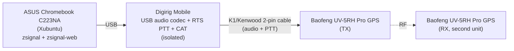
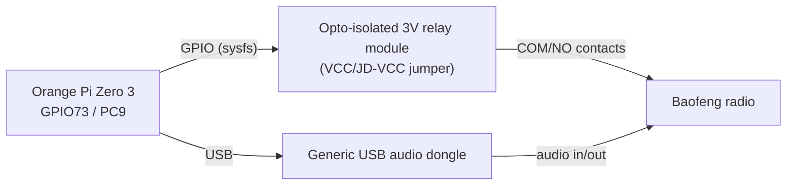

# Hardware

## Current setup: Xubuntu Chromebook + Digirig Mobile

| Component | Product | Role |
|---|---|---|
| Host computer | [ASUS Chromebook C223NA-DH02-RD](https://www.amazon.com/C223NA-DH02-RD-Chromebook-Dual-Core-Celeron-Processor/dp/B07H5B75SY) — Celeron N3350, 4GB RAM, 32GB eMMC | Runs Xubuntu; hosts `zsignal` (CLI/codec) and `zsignal-web` (Flask UI) |
| USB interface | [Digirig Mobile](https://www.amazon.com/dp/B095B9C15R) | USB audio codec + hardware PTT (RTS) + CAT, all in one USB connection. Galvanically isolated — this is what let PTT actually work reliably, after the Orange Pi's GPIO relay never did (see below and `PTT_NOTES.md`) |
| Radio interface cable | [Digirig Mobile Cables for Baofeng HTs](https://www.amazon.com/dp/B0B2GRR5GR) — black data cable, K1/Kenwood 2-pin connector | Carries audio in/out and PTT between the Digirig and the radio's 2.5mm/3.5mm jacks |
| Radios | [BAOFENG UV-5RH PRO GPS, 10W tri-band (2-pack)](https://www.amazon.com/dp/B0DKNHG7DF) | One as the TX radio (driven by zsignal), one as an independent RX radio for over-the-air verification |

Only the green CHIRP programming cable (a separate Digirig accessory, not the
black one) would be needed for editing radio channels — not used by zsignal
itself.

### Signal path

Everything from the Chromebook to the TX radio is one USB cable plus one
Digirig HT cable — no GPIO, no relay, no separate ground wire to the radio.

## Abandoned: Orange Pi Zero 3 + DIY relay

Kept here for context; full debugging history is in `PTT_NOTES.md`.

This circuit crashed the Orange Pi itself (not just the Python process) when
the relay coil switched — reproduced across multiple radios, wiring
configurations, and even a properly-isolated Digirig, which showed the Pi's
own power/USB headroom was the real constraint, not the relay. Moving the
Digirig to the Chromebook (its own battery/power management, no relay coil
at all) resolved it entirely.
